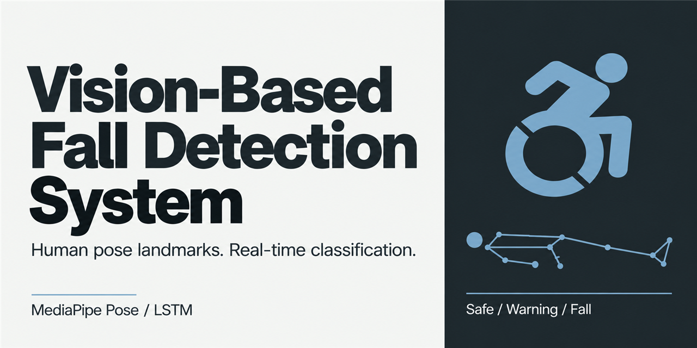
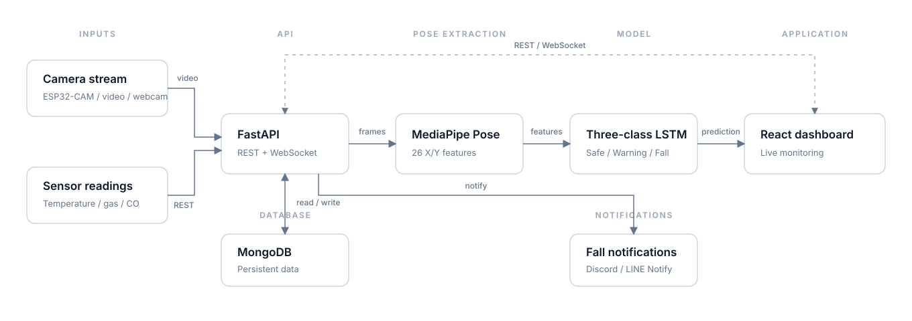

# Vision-Based Fall Detection System



An end-to-end research prototype for detecting falls from human pose landmarks. The system classifies each frame as **Safe**, **Warning**, or **Fall**, streams the result to a React dashboard, stores device data in MongoDB, and accepts readings from ESP32 camera and environmental sensor nodes.


## System overview

The detection path uses 13 MediaPipe Pose landmarks—nose, shoulders, elbows, wrists, hips, knees, and ankles—as 26 X/Y features. An LSTM converts those features into three Softmax probabilities.



The project is split into four working parts:

- **Model training** prepares the datasets, extracts pose features, balances the classes, and trains the LSTM.
- **API** serves account, device, contact, notification, and real-time detection endpoints.
- **Interface** displays cameras, prediction probabilities, account settings, and system administration pages.
- **ESP32 firmware** provides an RTSP camera stream and uploads temperature, gas, and carbon monoxide readings.

## Model

| Label | Class | Model output |
| ---: | --- | --- |
| `0` | Safe | No-Fall |
| `1` | Warning | Stumble |
| `2` | Fall | Fall |

The recorded three-class experiment used 10,200 test samples. It classified 9,933 correctly, for an accuracy of **97.38%**. The class recalls were 97.91% for Safe, 96.77% for Warning, and 97.48% for Fall.


The figures describe the experiment stored in this repository; they are not a general performance guarantee. Dataset preparation, parameters, the binary baseline, and the complete results are documented in [Train/README.md](Train/README.md).

## Repository structure

| Path | Contents |
| --- | --- |
| [`API/`](API/) | FastAPI application, MongoDB access, JWT authentication, detection WebSocket, and notification handlers |
| [`Interface/`](Interface/) | React 18 and TypeScript dashboard built with Material UI |
| [`Train/`](Train/) | Three-class dataset preparation, MediaPipe feature extraction, LSTM training, and evaluation |
| [`ESP32/`](ESP32/) | Wi-Fi camera and environmental sensor firmware |
| [`Document/`](Document/) | Model diagrams, evaluation plots, demo media, and editable diagrams |

### Prerequisites

- A Python environment compatible with TensorFlow 2.8.0 and MediaPipe 0.9.2.1
- MongoDB
- Node.js and npm
- A trained three-output Keras model
- Arduino IDE or PlatformIO for the optional ESP32 firmware

### Backend

Create and activate a virtual environment, then install the root dependencies:

```bash
python -m venv .venv
pip install -r requirements.txt
```

Create `API/.env`:

```dotenv
IP=127.0.0.1
PORT=8000
DB_IP=127.0.0.1
DB_PORT=27017
SECRET_KEY=replace-with-a-random-secret
THRESHOLD=70
```

The environmental sensor upload route also forwards readings to an external IoT API. Configure these values only when that integration is used:

```dotenv
API_IP=127.0.0.1
API_PORT=0000
API_TOKEN=replace-with-the-platform-token
MAC=replace-with-the-device-mac
TEMPLATEID=replace-with-the-template-id
```

The API loads its model from `API/model/LSTM_01.h5`. Train a model with the [training pipeline](Train/README.md), then place a compatible three-output model at that path.

The runtime also expects:

- `API/video/` for demo videos referenced by device records;
- `API/assets/images/paper.png` for the skeleton-only display mode;
- `API/assets/images/avatar/` for uploaded avatars and `API/assets/images/fall.png` for alert snapshots.

Start the backend from its directory so its relative paths resolve correctly:

```bash
cd API
python main.py
```

FastAPI exposes its interactive API documentation at `http://127.0.0.1:8000/docs` when the example host and port are used.

### MongoDB records

The database name is fixed to `Fall_Detection`. There is no seed script, so the initial records must be created manually.

| Collection | Required fields | Used for |
| --- | --- | --- |
| `User` | `name`, `role`, `username`, `password` | Login and account administration |
| `Device` | `name`, `camera`, `display`, `type` | Dashboard device list and video source selection |
| `Contact` | `name`, `phoneNumber`, `note` | Emergency contact cards |
| `Notification` | `class`, `token` | Discord and legacy LINE notification credentials |
| `Environment` | `temperature`, `gas`, `co`, `time` | Sensor history; populated by the upload endpoint |

At least one `User` document is required to sign in. A `Device` record must use `demo`, `camera`, or another value in its `type` field to select a stored video, an RTSP stream, or the local webcam.

### Frontend

Create `Interface/.env` with the backend address:

```dotenv
REACT_APP_IP=127.0.0.1
REACT_APP_PORT=8000
```

Install the packages and start the development server:

```bash
cd Interface
bun install
bun start
```

## Model training

Training is documented separately because it has its own dependencies and dataset contract:

- [Training overview, preprocessing, and experiment results](Train/README.md)
- [Numbered training tool reference](Train/tools/README.md)

Install the project dependencies from the repository root in an isolated environment, prepare the dataset, and run the numbered tools from `01` through `10`.

## ESP32 firmware

[`ESP32/WiFiCamera`](ESP32/WiFiCamera/) runs an OV2640 camera as an RTSP server on port 554. [`ESP32/EnvironmentalDetection`](ESP32/EnvironmentalDetection/) reads a DS18B20 temperature sensor plus MQ-5 and MQ-9 analog sensors, then posts the readings to `/api/device/upload`.

Before flashing either project:

1. Install the Arduino libraries referenced by its header files.
2. Select the correct ESP32 board and pin mapping.
3. Replace the API host and port in `ESP32/EnvironmentalDetection/Sensor.h`.
4. Use the WiFiManager access point created by the firmware to configure Wi-Fi.

## API surface

| Route | Purpose |
| --- | --- |
| `/api/user/*` | Authentication, profile updates, and administrator-managed accounts |
| `/api/device/*` | Device listing and environmental sensor uploads |
| `/api/contact/get` | Emergency contacts |
| `/api/notification/*` | Notification credentials and alert delivery |
| `/ws/detection/{camera_id}?draw=true` | JPEG frame stream and three-class prediction data |

The notification module contains Discord webhook support and a LINE Notify integration. LINE ended the LINE Notify service on March 31, 2025, so that branch must be replaced before it can send LINE alerts. See the [LINE Developers discontinuation notice](https://developers.line.biz/en/news/2024/10/07/line-notify-will-be-discontinued/).

## Security status

This code is a research prototype, not a production-ready monitoring service. The current implementation stores passwords in plain text, enables unrestricted CORS, runs FastAPI in debug mode, issues JWTs without expiration, and uses unencrypted HTTP and WebSocket connections. Notification credentials are also stored directly in MongoDB.

Do not expose the application to a public network without adding password hashing, scoped CORS, expiring tokens, TLS, secret management, input validation, and deployment-specific access controls.

## References

- Lin, C.-B., Dong, Z., Kuan, W.-K., and Huang, Y.-F. [*A Framework for Fall Detection Based on OpenPose Skeleton and LSTM/GRU Models*](https://doi.org/10.3390/app11010329). *Applied Sciences*, 11(1), 329, 2021.
- Google. [MediaPipe Pose landmark detection guide](https://developers.google.com/edge/mediapipe/solutions/vision/pose_landmarker).

## License

Project source code is available under the [Apache License 2.0](LICENSE), copyright 2023–2026 sky9154.

The bundled [Noto Sans TC Medium](Train/font/NotoSansTC-Medium.otf) font remains under the [SIL Open Font License 1.1](Train/font/OFL.txt). Third-party packages retain their own licenses. The project license does not grant rights to external datasets or models that are not distributed in this repository.
