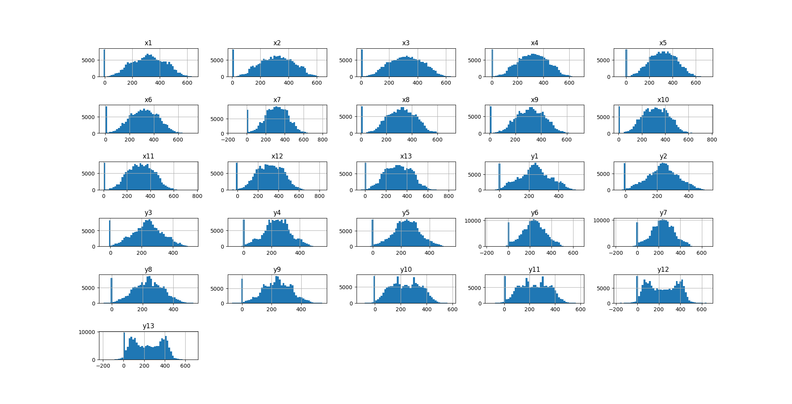
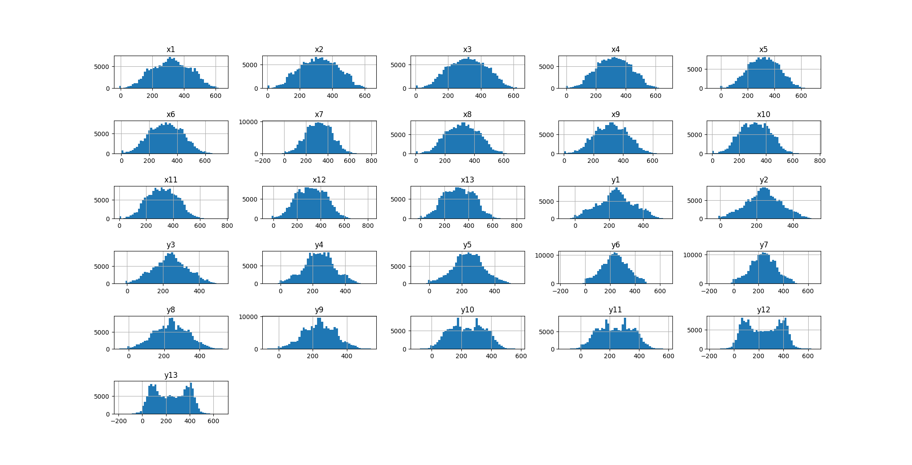

# Model training

This directory contains the active three-class training pipeline for the fall detection system. It prepares frame data, extracts pose landmarks with MediaPipe, trains an LSTM classifier, and runs video inference.

| Label | Class | Archived name |
| ---: | --- | --- |
| `0` | Safe | No-Fall |
| `1` | Warning | Stumble |
| `2` | Fall | Fall |

## Training workflow

The numeric prefixes show the intended execution order. Scripts with the same prefix are alternatives or optional steps.

| Stage | Tool | Purpose |
| ---: | --- | --- |
| 01 | [`01_images_resize.py`](tools/01_images_resize.py) | Resize images from the Fall Detection Dataset to 640 × 480. |
| 02 | [`02_images_classification.py`](tools/02_images_classification.py) | Map the Fall Detection Dataset labels to the three project classes. |
| 02 | [`02_images_classification_ur.py`](tools/02_images_classification_ur.py) | Map the UR Fall Detection Dataset labels to the same classes. |
| 03 | [`03_data_augmentation.py`](tools/03_data_augmentation.py) | Create optional geometric augmentations. |
| 03 | [`03_image_equalization.py`](tools/03_image_equalization.py) | Create optional equalized and grayscale images. |
| 04 | [`04_pose_get.py`](tools/04_pose_get.py) | Extract 13 body landmarks and write 26 coordinate features. |
| 05 | [`05_dataset_check.py`](tools/05_dataset_check.py) | Inspect CSV statistics and feature distributions. |
| 06 | [`06_linear_interpolation.py`](tools/06_linear_interpolation.py) | Replace missing pose coordinates with linear interpolation. |
| 07 | [`07_data_sampled.py`](tools/07_data_sampled.py) | Balance the three classes. |
| 08 | [`08_merge_csv.py`](tools/08_merge_csv.py) | Merge and shuffle the class CSV files. |
| 09 | [`09_train_lstm.py`](tools/09_train_lstm.py) | Train the three-class LSTM from the command line. |
| 09 | [`09_lstm_model.ipynb`](tools/09_lstm_model.ipynb) | Run the same training stages in a notebook. |
| 10 | [`10_fall.py`](tools/10_fall.py) | Test a trained model against a video. |

See [`tools/README.md`](tools/README.md) for the command sequence and the input/output contract of each stage.

## Pose features

MediaPipe Pose returns 33 body landmarks. This project keeps 13 of them: the nose and the left/right shoulders, elbows, wrists, hips, knees, and ankles. Their X/Y coordinates form the model's 26 input features.


`04_pose_get.py` letterboxes each frame to 1280 × 720 before extracting the coordinates. If MediaPipe cannot detect a pose, the script writes zeros for that frame so the interpolation stage can repair the missing values.

## Preprocessing

### Data augmentation

Rotation and other geometric transforms can add variation when the source dataset is small. Augmentation is optional: run [`03_data_augmentation.py`](tools/03_data_augmentation.py) and select the augmented source when extracting pose features.

### Hip-centered coordinates

The optional `--normalize` flag translates the skeleton so the midpoint between the hips sits at the center of the 1280 × 720 feature canvas. For left and right hip coordinates \((X_{Lhip}, Y_{Lhip})\) and \((X_{Rhip}, Y_{Rhip})\):

$$
X_{BM} = \frac{X_{Lhip} + X_{Rhip}}{2}, \qquad
Y_{BM} = \frac{Y_{Lhip} + Y_{Rhip}}{2}
$$

For a canvas of width \(W\) and height \(H\):

$$
X_{dis} = X_{BM} - \frac{W}{2}, \qquad
Y_{dis} = Y_{BM} - \frac{H}{2}
$$

Each landmark is then translated by the same offset:

$$
X_r = X_n - X_{dis}, \qquad
Y_r = Y_n - Y_{dis}
$$


### Linear interpolation

Zero values mark frames where no pose was detected. [`06_linear_interpolation.py`](tools/06_linear_interpolation.py) treats those values as missing and interpolates each feature within its class.

Before interpolation, zero-value spikes remain visible across several features:



After interpolation, the zero-value gaps are filled from neighboring frames:



## Train the model

Install the dependencies from an isolated Python environment:

```bash
pip install -r requirements.txt
```

TensorFlow 2.8.0 and MediaPipe 0.9.2.1 come from the project's original environment and require a compatible Python version.

From the `Train` directory, the command-line workflow ends with:

```bash
python tools/09_train_lstm.py DATASET/data.csv --output model/LSTM_03.h5
python tools/10_fall.py --model model/LSTM_03.h5 --video video/fall.mp4
```

Replace `DATASET` with the prepared dataset path. The complete preparation commands are listed in [`tools/README.md`](tools/README.md).

### Current CLI defaults

| Parameter | Default |
| --- | ---: |
| Train/test split | 80% / 20% |
| Random seed | 42 |
| Input features | 26 |
| LSTM hidden units | 512 |
| Output units | 3 |
| LSTM activation | Tanh |
| Output activation | Softmax |
| Optimizer | Adam |
| Learning rate | 0.001 |
| Loss | Categorical cross-entropy |
| Batch size | 128 |
| Epochs | 500 |

The notebook retains a batch size of 1,280. Pass `--batch-size 1280` to the CLI if an exact notebook-style run is required.

## Experiment results

### Binary classification

The binary model classifies each sequence as **No-Fall** or **Fall**. Each sequence contains 100 consecutive records. The two source datasets contributed 800 sequences per class:

| Dataset | Non-fall sequences | Fall sequences |
| --- | ---: | ---: |
| UR Fall Detection Dataset | 320 | 320 |
| Fall Detection Dataset | 480 | 480 |
| Combined dataset | 800 | 800 |

The model was trained on an NVIDIA A100 GPU with an Intel Xeon CPU. The experiment used 1,280 sequences for training and 320 for testing.

| Parameter | Value |
| --- | ---: |
| Input features | 26 |
| LSTM hidden units | 512 |
| Output units | 2 |
| Learning rate | 0.001 |
| Batch size | 1,280 |
| Epochs | 500 |
| Activation | Tanh |
| Optimizer | Adam |
| Loss | Cross-entropy |


Training accuracy approached 99%, while validation accuracy remained close to 98% after convergence.


| Test loss | Test accuracy | Correct predictions | Incorrect predictions |
| ---: | ---: | ---: | ---: |
| 0.1022 | 97.81% | 31,298 | 702 |

The normalized confusion matrix shows a recall of 0.99 for **No-Fall** and 0.93 for **Fall**.


### Three-class classification

The three-class model extends the output layer to **No-Fall**, **Stumble**, and **Fall**. These classes correspond to the current **Safe**, **Warning**, and **Fall** labels.


The training and validation curves cover 1,000 epochs. Validation accuracy converged near 97%, with a small gap between the training and validation curves.


The test set contains 10,200 samples. The model classified 9,933 correctly, giving an overall accuracy of **97.38%**.

| True class | Predicted Safe | Predicted Warning | Predicted Fall | Recall |
| --- | ---: | ---: | ---: | ---: |
| Safe | 3,326 | 52 | 19 | 97.91% |
| Warning | 37 | 3,359 | 75 | 96.77% |
| Fall | 19 | 65 | 3,248 | 97.48% |


## Demo


[Download the full demo video](../Document/video/Fall_Detection_Test.mp4)

## References

- Lin, Chuan-Bi, et al. [*A Framework for Fall Detection Based on OpenPose Skeleton and LSTM/GRU Models*](http://ir.lib.cyut.edu.tw:8080/bitstream/310901800/38339/1/108CYUT0652018-003.pdf). *Applied Sciences*, 11(1), 329, 2020.
- Google. [MediaPipe Pose landmark detection guide](https://developers.google.com/edge/mediapipe/solutions/vision/pose_landmarker).